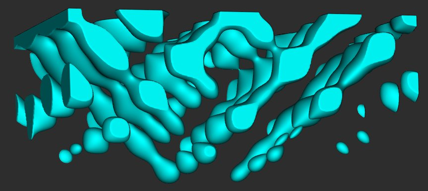

# Parametric Gray-Scott Reaction-Diffusion for OpenVCAD


Convert reaction-diffusion mathematics into manufacturable 3D geometry using OpenVCAD's volumetric modeling capabilities.

## What This Does

This project transforms **Gray-Scott reaction-diffusion equations** into **3D printable geometry**. Instead of just simulating chemical patterns on screens, we create **physical objects** where the reaction-diffusion mathematics becomes **solid topology**.

### Key Innovation
- **Ready simulation data** → **3D manufacturable geometry**
- **Chemical concentrations** → **Material distributions**
- **Pattern evolution** → **Spatial structures**
- **Mathematical surfaces** → **Printable objects**

## Features

- **Parametric control** over pattern characteristics
- **3D printing optimized** with manifold geometry options
- **Direct implementation** of Gray-Scott equations from Ready format
- **Real-time parameter adjustment** for design exploration
- **Automatic boundary closure** for watertight geometry

## Parameters Reference

### Primary Controls

#### `threshold` - Geometry Amount
- **0.2**: Dense, coral-like structures (lots of geometry)
- **0.4**: Medium density (balanced)
- **0.6**: Sparse, minimal structures (little geometry)

#### `time_param` - Pattern Evolution
- **0.0**: Early-stage patterns (simple, nucleated)
- **0.5**: Mid-evolution (complex interactions)
- **1.0**: Mature patterns (fully developed)

#### `frequency_scale` - Pattern Size
- **0.5**: Large, macro-scale features
- **1.0**: Natural scale
- **2.0**: Fine, micro-scale details

#### `amplitude` - Pattern Intensity
- **0.1**: Subtle, gentle patterns
- **0.8**: Strong, dramatic patterns

#### `evolution_rate` - Spatial Variation
- **0.5**: Slow spatial changes
- **2.0**: Rapid spatial variation

### 3D Printing Controls

#### `make_printable` (Boolean)
- **True**: Manifold, watertight geometry with boundary closure
- **False**: Pure mathematical surfaces (artistic/exploration)

## Ready Presets

Try these parameter combinations for different aesthetic results:

### "Coral Growth"
```python
threshold = 0.25
time_param = 0.3
frequency_scale = 0.8
amplitude = 0.4
```

### "Crystal Lattice"
```python
threshold = 0.45
time_param = 0.7
frequency_scale = 1.5
amplitude = 0.6
```

### "Organic Maze"
```python
threshold = 0.35
time_param = 0.5
frequency_scale = 1.0
amplitude = 0.4
```

### "Minimal Architecture"
```python
threshold = 0.55
time_param = 0.8
frequency_scale = 2.0
amplitude = 0.3
```

## Example Parameter Sets

### Beginner

#### Simple Coral Structure
```python
threshold = 0.3
time_param = 0.2
frequency_scale = 0.8
amplitude = 0.4
evolution_rate = 1.0
make_printable = True
```
- Dense, branching coral-like structure; good starting point.

#### Geometric Lattice
```python
threshold = 0.5
time_param = 0.8
frequency_scale = 1.5
amplitude = 0.5
evolution_rate = 0.8
make_printable = True
```
- Regular, geometric patterns with solid connectivity.

### Advanced

#### Organic Architecture
```python
threshold = 0.4
time_param = 0.6
frequency_scale = 1.2
amplitude = 0.6
evolution_rate = 1.5
make_printable = True
```
- Building-like structures with smooth flow; ideal for architectural exploration.

#### Jewelry Scale
```python
threshold = 0.45
time_param = 0.7
frequency_scale = 2.0
amplitude = 0.3
evolution_rate = 1.8
make_printable = True
```
- Fine, intricate motifs suited for small prints.

#### Vase-like Structures
```python
threshold = 0.35
time_param = 0.4
frequency_scale = 0.9
amplitude = 0.5
evolution_rate = 1.2
make_printable = True
```
- Hollow, vessel-like forms with organic walls.

### Artistic Exploration

#### Abstract Sculpture
```python
threshold = 0.25
time_param = 0.9
frequency_scale = 0.6
amplitude = 0.7
evolution_rate = 2.0
make_printable = False  # visualization only
```
- Complex, expressive geometry for renderings or experimentation.

#### Minimal Forms
```python
threshold = 0.6
time_param = 0.3
frequency_scale = 1.8
amplitude = 0.2
evolution_rate = 0.5
make_printable = True
```
- Clean silhouettes with restrained detailing.

### Troubleshooting Cheatsheet
- **Too dense**: increase `threshold` (0.4 → 0.5) or decrease `amplitude` (0.6 → 0.4).
- **Too sparse**: decrease `threshold` (0.5 → 0.3) or increase `amplitude` (0.3 → 0.5).
- **Pattern too large**: increase `frequency_scale` (1.0 → 1.5).
- **Pattern too small**: decrease `frequency_scale` (1.0 → 0.7).
- **Not printable**: set `make_printable = True`
## Usage

1. **Install OpenVCAD Studio** from [OpenVCAD releases](https://github.com/MacCurdyLab/OpenVCAD-Public/releases)

2. **Load the script**:
   - Open VCAD Studio
   - Load `gray_scott_parametric.py`

3. **Adjust parameters**:
   - Edit parameter values at the top of the file
   - Reload to see changes

4. **Export for 3D printing**:
   - Set `make_printable = True`
   - Export as STL/OBJ from VCAD Studio

## Mathematical Background

This implementation converts the Gray-Scott reaction-diffusion system:

```
∂u/∂t = Du∇²u - uv² + F(1-u)
∂v/∂t = Dv∇²v + uv² - (F+k)v
```

Into spatial material distributions using trigonometric approximations of the steady-state solutions. The `time_param` controls which "snapshot" of the temporal evolution becomes the 3D geometry.

## Applications

- **Biomimetic structures**: Tissue scaffolds, bone-like gradients
- **Architectural elements**: Organic facades, structural optimization
- **Art and design**: Sculptural objects, jewelry, decorative elements
- **Metamaterials**: Programmable material properties
- **Research**: Reaction-diffusion visualization, educational models

## Comparison with Traditional Tools

| **Traditional RD Tools** | **This Implementation** |
|--------------------------|-------------------------|
| Screen visualization | Physical 3D objects |
| Time-domain simulation | Spatial geometry |
| Single chemical display | Multi-material structures |
| Research/analysis focus | Manufacturing focus |

## Requirements

- **OpenVCAD Studio** (Windows/Mac/Linux)
- **3D Printer** (optional, for physical output)
- **Slicer software** (for 3D printing workflow)

## License

This implementation is provided for academic and research use. Please cite appropriately if used in publications.

## Contributing

Contributions welcome! Areas for enhancement:
- Additional reaction-diffusion systems (Turing, FitzHugh-Nagumo)
- Parameter optimization algorithms
- Multi-material printing support
- Animation/morphing capabilities

## Citations

This work builds upon several key contributions to reaction-diffusion research and simulation:

### Ready Simulator
Tim Hutton, Robert Munafo, Andrew Trevorrow, Tom Rokicki, Dan Wills.
"Ready, a cross-platform implementation of various reaction-diffusion systems."
GitHub: https://github.com/GollyGang/ready
arXiv: http://arxiv.org/abs/1501.01990

### Gray-Scott System
Pearson, J. E. (1993). "Complex patterns in a simple system."
*Science*, 261(5118), 189-192.
DOI: https://www.science.org/doi/10.1126/science.261.5118.189

### OpenVCAD Platform
Matter Assembly Computation Lab, University of Colorado Boulder.
"OpenVCAD: Systems and Processes for Volumetric Multi-Material 3D Models"
GitHub: https://github.com/MacCurdyLab/OpenVCAD-Public

## Acknowledgments

- **Ready development team** for the foundational reaction-diffusion simulation framework
- **OpenVCAD** development team at University of Colorado Boulder for volumetric modeling capabilities
- **Gray-Scott system** researchers for the mathematical foundation
